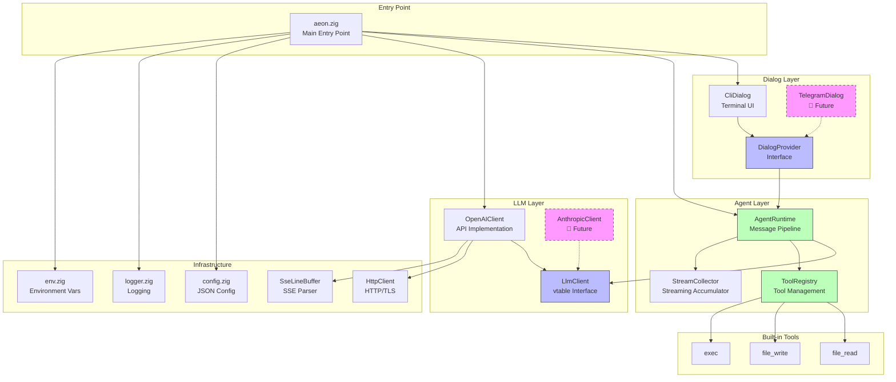
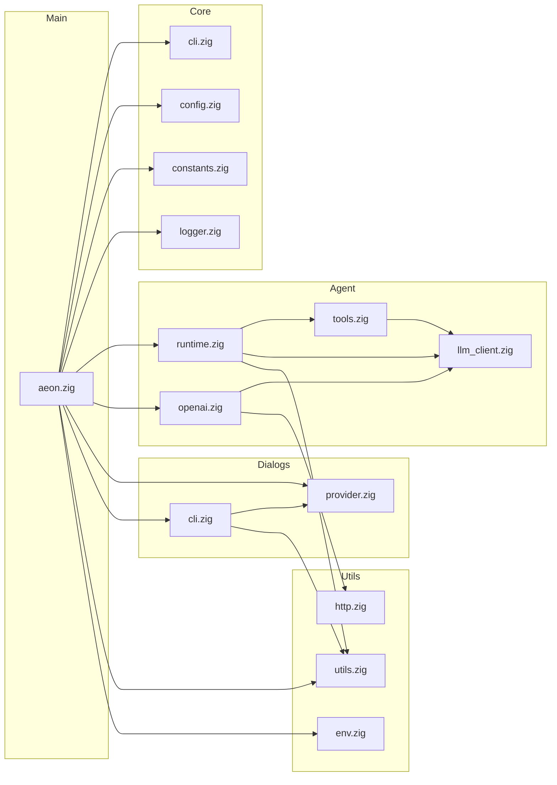
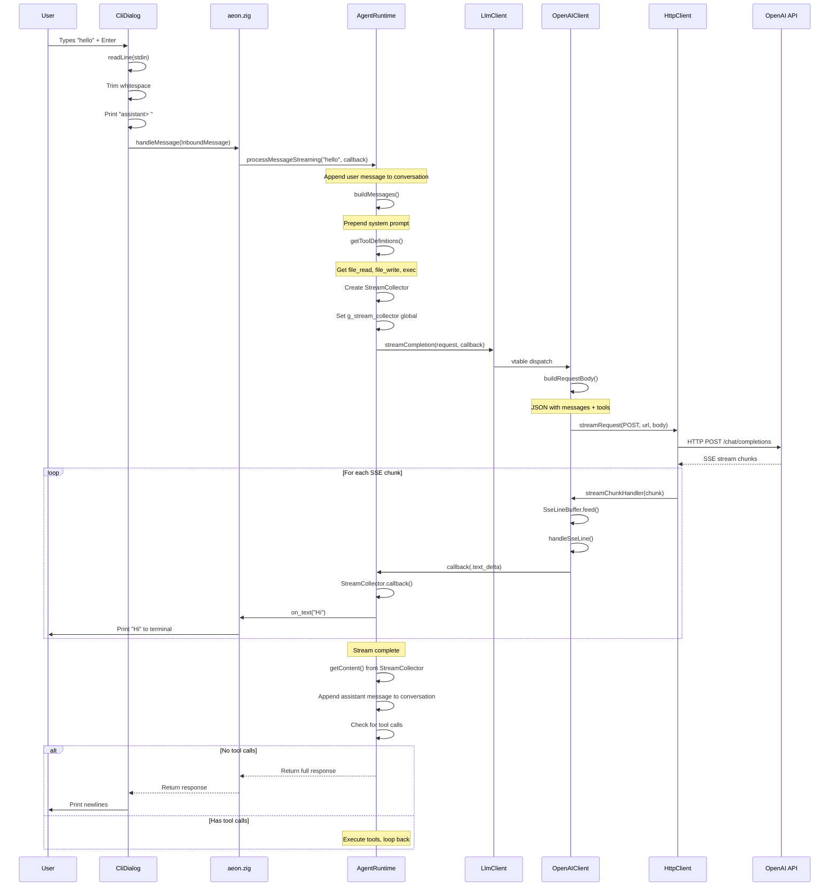
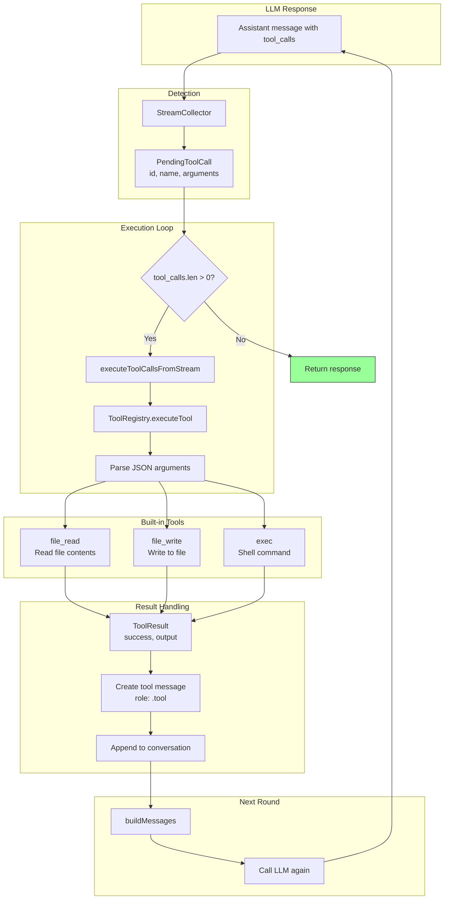
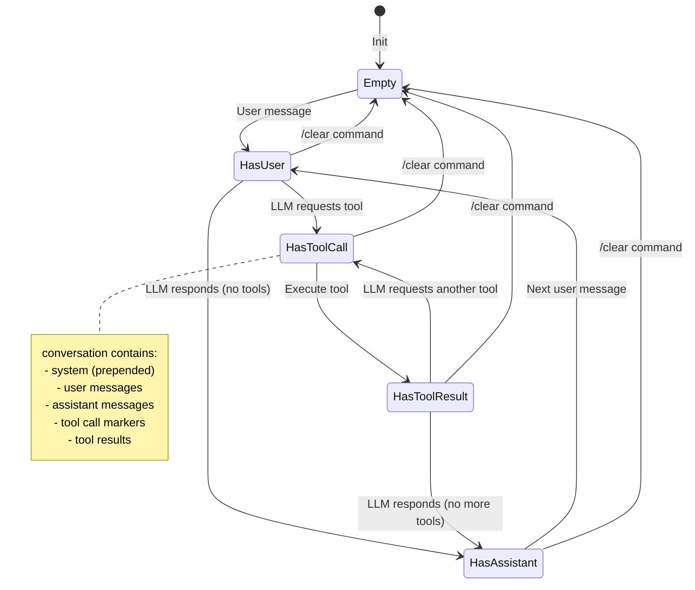
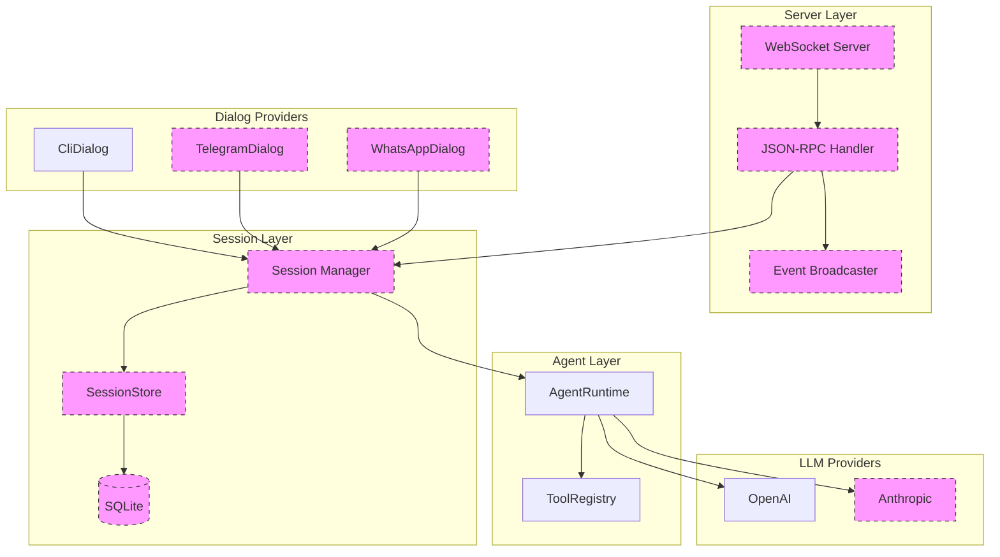

# Aeon — System Architecture

This document provides visual diagrams explaining the system architecture, module interactions, and message flow through the application.

---

## Table of Contents

1. [High-Level System Architecture](#high-level-system-architecture)
2. [Module Dependency Graph](#module-dependency-graph)
3. [Message Flow: User → LLM → User](#message-flow-user--llm--user)
4. [Streaming Data Flow](#streaming-data-flow)
5. [Tool Execution Flow](#tool-execution-flow)
6. [Module Reference](#module-reference)

---

## High-Level System Architecture

This diagram shows all major components and how they relate to each other:



### Component Descriptions

| Component | File | Purpose |
|-----------|------|---------|
| **aeon.zig** | `src/aeon.zig` | Application entry point. Parses CLI args, loads config, initializes all components, starts the dialog loop. |
| **DialogProvider** | `src/dialogs/provider.zig` | vtable interface for dialog backends. Defines `start()`, `send()`, `deinit()`. |
| **CliDialog** | `src/dialogs/cli.zig` | Interactive terminal chat. Reads stdin, prints responses, handles `/commands`. |
| **AgentRuntime** | `src/agent/runtime.zig` | Core message processing pipeline. Manages conversation history, orchestrates LLM calls, handles tool loop. |
| **ToolRegistry** | `src/agent/tools.zig` | Stores and executes tools. Provides tool definitions to LLM requests. |
| **StreamCollector** | `src/agent/runtime.zig` | Accumulates text deltas and tool calls during streaming. |
| **LlmClient** | `src/agent/llm_client.zig` | vtable interface for LLM providers. Defines `streamCompletion()`, `completion()`. |
| **OpenAIClient** | `src/agent/openai.zig` | OpenAI API implementation. Handles request building, SSE parsing, response extraction. |
| **HttpClient** | `src/utils/http.zig` | Wrapper around `std.http.Client`. Supports both full-response and streaming requests. |
| **SseLineBuffer** | `src/agent/llm_client.zig` | Parses SSE (Server-Sent Events) streams line by line. |

---

## Module Dependency Graph

This shows the import relationships between all source files:



---

## Message Flow: User → LLM → User

This sequence diagram shows the complete journey of a user message through the system:



---

## Streaming Data Flow

This diagram shows how streaming data flows through the callback chain:

```mermaid
flowchart TB
    subgraph "OpenAI API Response"
        SSE["SSE Stream<br/>data: {choices:[{delta:{content:'Hi'}}]}"]
    end

    subgraph "HTTP Layer"
        HC[HttpClient.streamRequest]
        CHUNK["4KB Chunks"]
    end

    subgraph "SSE Parsing"
        SCH[streamChunkHandler]
        SLB[SseLineBuffer.feed]
        HSL[handleSseLine]
    end

    subgraph "Event Dispatch"
        CB1["callback(.text_delta)"]
        CB2["callback(.tool_call)"]
        CB3["callback(.done)"]
    end

    subgraph "Stream Collection"
        SC[StreamCollector.callback]
        GSC[g_stream_collector<br/>Global Pointer]
        TB[text_buf<br/>ArrayList]
        TC[tool_calls<br/>ArrayList]
    end

    subgraph "User Callback"
        OT[on_text callback]
        STD[streamTextDelta]
        OUT[stdout print]
    end

    SSE --> HC
    HC --> CHUNK
    CHUNK --> SCH
    SCH --> SLB
    SLB -->|Complete line| HSL
    
    HSL -->|text delta| CB1
    HSL -->|tool call| CB2
    HSL -->|[DONE]| CB3
    
    CB1 --> SC
    CB2 --> SC
    CB3 --> SC
    
    SC --> GSC
    GSC --> TB
    GSC --> TC
    
    SC -->|text_delta| OT
    OT --> STD
    STD --> OUT

    style GSC fill:#ff9,stroke:#333
    style OUT fill:#9f9,stroke:#333
```

### Why the Global Pointer?

Zig function pointers cannot capture context (no closures). The streaming chain requires passing data through several layers:

```
OpenAI SSE → HttpClient → streamChunkHandler → handleSseLine → callback → StreamCollector
```

Each step uses bare function pointers. To give `StreamCollector.callback` access to its `self`, we use:

```zig
var g_stream_collector: ?*StreamCollector = null;
```

**Critical:** This pointer must be set in the **caller** after `init()` returns, not inside `init()`, because `init()` returns by value and the local's stack address becomes invalid.

---

## Tool Execution Flow

When the LLM decides to call a tool, this flow executes:



### Tool Loop Limits

The `max_tool_rounds` field (default: 10) prevents infinite loops. If the LLM keeps calling tools beyond this limit, the runtime returns `"[Max tool rounds exceeded]"`.

---

## Conversation State Machine

This shows how conversation history evolves:



### Message Roles

| Role | Description |
|------|-------------|
| `.system` | System prompt (prepended at each LLM call, not stored in conversation) |
| `.user` | User input from dialog |
| `.assistant` | LLM text response |
| `.tool` | Tool execution result (includes `tool_call_id` and `name`) |

---

## Module Reference

### Entry Point

```
┌─────────────────────────────────────────────────────────────┐
│ aeon.zig                                                    │
├─────────────────────────────────────────────────────────────┤
│ Responsibilities:                                           │
│ • Parse CLI arguments (--version, --help, --config=)        │
│ • Load JSON configuration                                   │
│ • Initialize logger                                         │
│ • Read OPENAI_API_KEY from environment                      │
│ • Create OpenAIClient → LlmClient                           │
│ • Create AgentRuntime with system prompt                    │
│ • Create CliDialog → DialogProvider                         │
│ • Start dialog loop (blocking)                              │
├─────────────────────────────────────────────────────────────┤
│ Globals:                                                    │
│ • g_runtime: ?*AgentRuntime — for handleMessage callback    │
│ • SYSTEM_PROMPT — compile-time string                       │
├─────────────────────────────────────────────────────────────┤
│ Functions:                                                  │
│ • main() — entry point                                      │
│ • handleMessage(InboundMessage) ![]const u8                 │
│ • streamTextDelta([]const u8) !void                         │
└─────────────────────────────────────────────────────────────┘
```

### Dialog Layer

```
┌─────────────────────────────────────────────────────────────┐
│ provider.zig                                                │
├─────────────────────────────────────────────────────────────┤
│ Types:                                                      │
│ • InboundMessage — dialog, from, text, timestamp            │
│ • MessageHandler — fn(InboundMessage) ![]const u8           │
│ • DialogProvider — vtable interface                         │
│ • DialogProvider.VTable — start, send, deinit               │
└─────────────────────────────────────────────────────────────┘

┌─────────────────────────────────────────────────────────────┐
│ cli.zig                                                     │
├─────────────────────────────────────────────────────────────┤
│ Types:                                                      │
│ • CliDialog — allocator, running                            │
├─────────────────────────────────────────────────────────────┤
│ Features:                                                   │
│ • ASCII banner on startup                                   │
│ • "you> " prompt                                            │
│ • Slash commands: /quit, /exit, /clear, /help               │
│ • Byte-by-byte stdin reading (no readUntilDelimiter)        │
│ • Streaming response output                                 │
└─────────────────────────────────────────────────────────────┘
```

### Agent Layer

```
┌─────────────────────────────────────────────────────────────┐
│ runtime.zig                                                 │
├─────────────────────────────────────────────────────────────┤
│ Types:                                                      │
│ • AgentRuntime — main orchestrator                          │
│ • StreamCollector — accumulates stream data                 │
│ • PendingToolCall — buffers for streaming tool calls        │
├─────────────────────────────────────────────────────────────┤
│ AgentRuntime fields:                                        │
│ • allocator, client, tool_registry                          │
│ • conversation (ArrayList of messages)                      │
│ • system_prompt, model, max_tool_rounds                     │
├─────────────────────────────────────────────────────────────┤
│ Key methods:                                                │
│ • processMessage() — non-streaming                          │
│ • processMessageStreaming() — streaming with callback       │
│ • clearHistory() — reset conversation                       │
│ • buildMessages() — prepend system prompt                   │
│ • executeToolCalls() — run tools, append results            │
└─────────────────────────────────────────────────────────────┘

┌─────────────────────────────────────────────────────────────┐
│ tools.zig                                                   │
├─────────────────────────────────────────────────────────────┤
│ Types:                                                      │
│ • ToolRegistry — HashMap of name → RegisteredTool           │
│ • RegisteredTool — definition + execute function            │
│ • ToolResult — success, output, error_msg                   │
│ • ToolContext — allocator, working_dir                      │
│ • ParamDef — helper for parameter definitions               │
├─────────────────────────────────────────────────────────────┤
│ Built-in tools:                                             │
│ • file_read(path) → file contents                           │
│ • file_write(path, content) → success message               │
│ • exec(command) → stdout + stderr                           │
└─────────────────────────────────────────────────────────────┘
```

### LLM Layer

```
┌─────────────────────────────────────────────────────────────┐
│ llm_client.zig                                              │
├─────────────────────────────────────────────────────────────┤
│ Shared Types:                                               │
│ • MessageRole — system, user, assistant, tool               │
│ • Message — role, content, name, tool_call_id               │
│ • Tool, ToolParameter, ToolCall                             │
│ • StreamEvent — text_delta, tool_call, done, error          │
│ • CompletionRequest, CompletionResponse                     │
│ • StreamCallback — fn(StreamEvent) !void                    │
├─────────────────────────────────────────────────────────────┤
│ Interface:                                                  │
│ • LlmClient — vtable-based polymorphic interface            │
│ • LlmClient.VTable — deinit, streamCompletion, completion   │
├─────────────────────────────────────────────────────────────┤
│ Utilities:                                                  │
│ • SseLineBuffer — SSE stream parser                         │
│ • parseSseDataLine() — extract "data: " payload             │
│ • writeJsonEscaped() — JSON string escaping                 │
└─────────────────────────────────────────────────────────────┘

┌─────────────────────────────────────────────────────────────┐
│ openai.zig                                                  │
├─────────────────────────────────────────────────────────────┤
│ Types:                                                      │
│ • OpenAIClient — allocator, api_key, base_url, http_client  │
│ • OpenAIRequest, OpenAIMessage, OpenAITool                  │
├─────────────────────────────────────────────────────────────┤
│ Key methods:                                                │
│ • asLlmClient() — return vtable interface                   │
│ • streamCompletion() — streaming API call                   │
│ • completion() — non-streaming API call                     │
│ • buildRequestBody() — JSON serialization                   │
├─────────────────────────────────────────────────────────────┤
│ SSE handling:                                               │
│ • StreamContext — callback + line buffer                    │
│ • streamChunkHandler() — process HTTP chunks                │
│ • handleSseLine() — parse OpenAI SSE format                 │
└─────────────────────────────────────────────────────────────┘
```

### Infrastructure

```
┌─────────────────────────────────────────────────────────────┐
│ http.zig                                                    │
├─────────────────────────────────────────────────────────────┤
│ Types:                                                      │
│ • HttpClient — wrapper around std.http.Client              │
│ • Response — status, body, allocator                        │
├─────────────────────────────────────────────────────────────┤
│ Methods:                                                    │
│ • post(url, headers, body) → Response                       │
│ • get(url, headers) → Response                              │
│ • streamRequest(method, url, headers, body, ctx, cb) → Status│
└─────────────────────────────────────────────────────────────┘

┌─────────────────────────────────────────────────────────────┐
│ env.zig                                                     │
├─────────────────────────────────────────────────────────────┤
│ Functions:                                                  │
│ • get(key) → ?[]const u8                                    │
│ • getOrDefault(key, default) → []const u8                   │
│ • getRequired(key) → []const u8 or error                    │
└─────────────────────────────────────────────────────────────┘

┌─────────────────────────────────────────────────────────────┐
│ config.zig                                                  │
├─────────────────────────────────────────────────────────────┤
│ Types:                                                      │
│ • Config — log_file_path, ...                               │
├─────────────────────────────────────────────────────────────┤
│ Methods:                                                    │
│ • loadFromFile(allocator, path) → Config                    │
└─────────────────────────────────────────────────────────────┘
```

---

## Future Architecture (Phase 3+)



This shows planned components for Phase 3 (Server/Sessions) and Phase 4 (Telegram).
